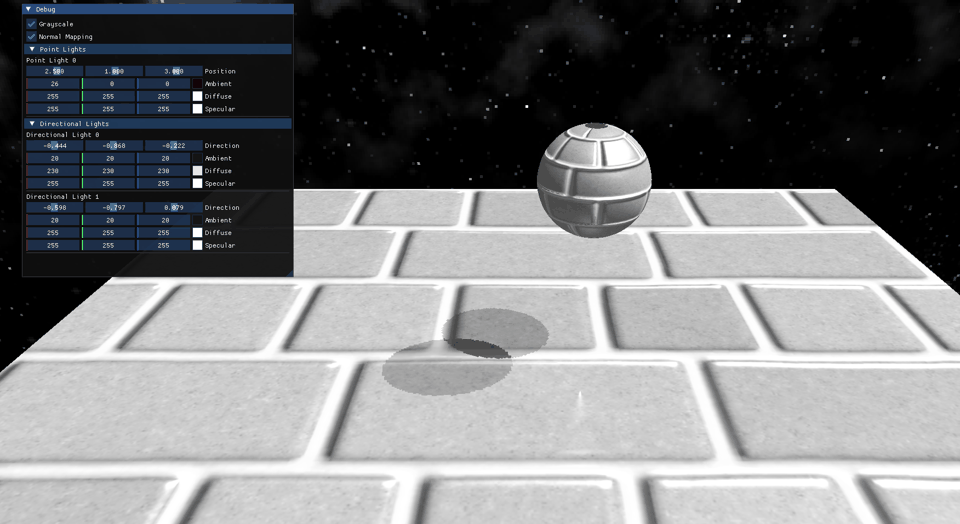

# 🌌 Lights and Shadows - OpenGL

A modern OpenGL rendering demo showcasing real-time lighting and shadow techniques, built with a structured rendering pipeline and clean engine-style architecture.

## 🚀 Features

- 🌞 Directional Lighting with Shadows  
- 🌑 Shadow Mapping (Depth-based shadows)  
- 🧱 Modular Rendering Architecture  
- 🎨 Texture & Asset Management  
- 🌌 Skybox Rendering  
- 🛠️ ImGui Debug Interface  

## 📸 Demo

## 🧠 Rendering Pipeline

Shadow Pass → Scene Rendering Pass → Lighting → Final Output

## 🛠️ Tech Stack

- C++20
- OpenGL
- GLFW / GLEW
- ImGui
- GLM

## 📂 Project Structure

- /assets
- /src
- /include

## ⚙️ Build & Run

- git clone https://github.com/jookarim/Lights_And_Shadows_OpenGL.git
- cd Lights_And_Shadows_OpenGL
- mkdir build
- cd build
- cmake ..
- cmake --build .

## 📌 Author

Joo – Graphics Programming Student
